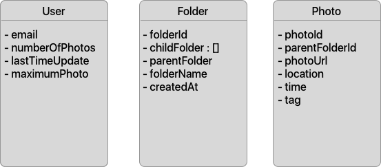
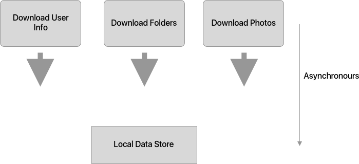
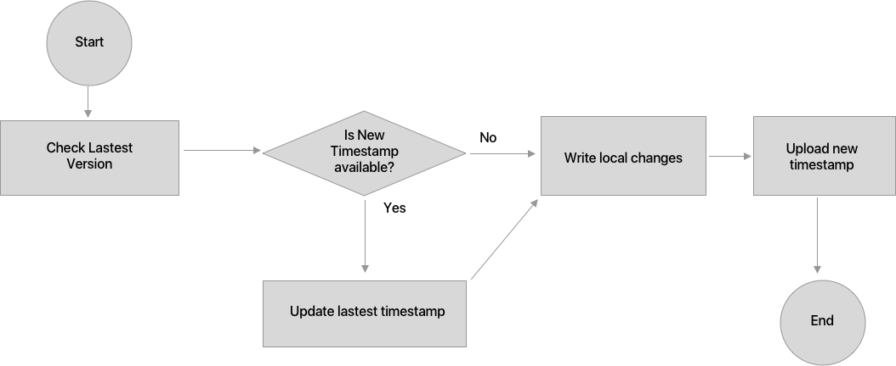
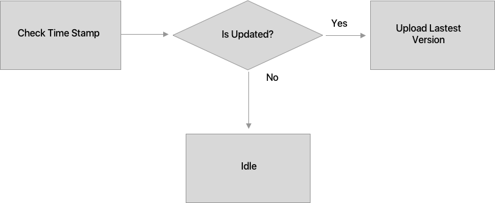

# MOBILE DATA SYNCHRONIZATION STRATEGIES

>**USE CASE:**  
> Synchronization Data Store for X Application.  
> Application X allow user to store their personal photos in folders, User can synchronize photos from different devices.
> 1. **User Profile** : *gmail, number of Photos, last time update, number of maximum photos*
> 2. **Folder Structure** : *List Of Folder, Each Folder might contain there child folders and parent folder, folder content (Photo URL)*
> 3. **Photo Exif** : *Location, time, tag*  
>  

# 1.  **First Time Synchronization** 

    When application running for the first time after installing, we need to download all the data store that needed from server. If data store is big, the downloading process might be take along time to finish. Hence, the user experience will be reduced.

    There are two casual pattern to make this 

    * Async - Download 
    * High-Priority Download  
  

   
   >1. Async-Download  

   Seperate datastore into different part, do download each part async. 
   - iOS : GCD, Download Task
   - Android : AsyncTask

    For Example : 
  
    

    
  #### Pros:  
  - Faster download
  #### Cons:
  - Use alot of Resources since there are severals thread running at the same time
  

    >2. High-Priority Download

    Sometimes, if the data store is too big, we will need to consider about priorities of data parts. 

    For Example :

        - User data and Folder Structure's Priority is higher than Photo, Because User Data and Folder Structure need to display first. Photo's data can be download later when user open the folder and photos. 
    
    Depend on application requirements, we can define which data need to sync for the first time, which will be download later asynchronously.

 
 

# 2. **Keep application up-to-date**

    When to keep application up-to-date?  

>1.When Delete/Insert/Update Triggered 

    Everytime application trigger an CRUD action we should check the lastest version to make sure that local datastore is updateToDate

>2.Check up-to-date by following Screen Life-Cycle
    
    Call check up-to-date in those functions :
    - iOS : ViewDidLoad | ViewWillAppear | ViewDidAppear
    - Android : OnResume | OnCreate
    
*if There are new updates, updating process should be run in background to avoid responsiveness that may cause reducing User Experiences*

*We can use Timer to avoid overload due to exceed limit request from client*

>3. Trigger updating from server

    We can use Google Clound Message or Apple Push Notification to trigger new version updating from Server.

    *updating process should be run in background too*

 
 

# 3. **Keep server up-todate**
   
   >  Uploading every time an CRUD action is trigged

   

 
 

# 4. **Cache Synchronize-Request**
   
   Sometimes, if the network is interupted when synchronization is processing, the unfinished request should be cached and re-synchronize when device go online.

   Local storage for Caching :
   
   - iOS : 
        * CoreData
        * Realm
        * Sqlite
        * Plist
   - Android:
        * Sqlite
        * Realm
        * SharePreferences
   

   Caching Request should be follow Singleton Pattern

   
   